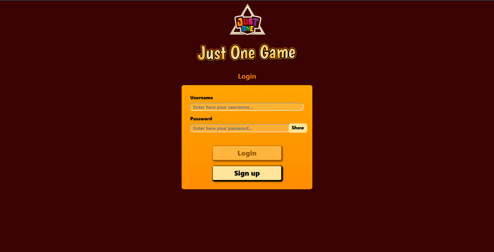
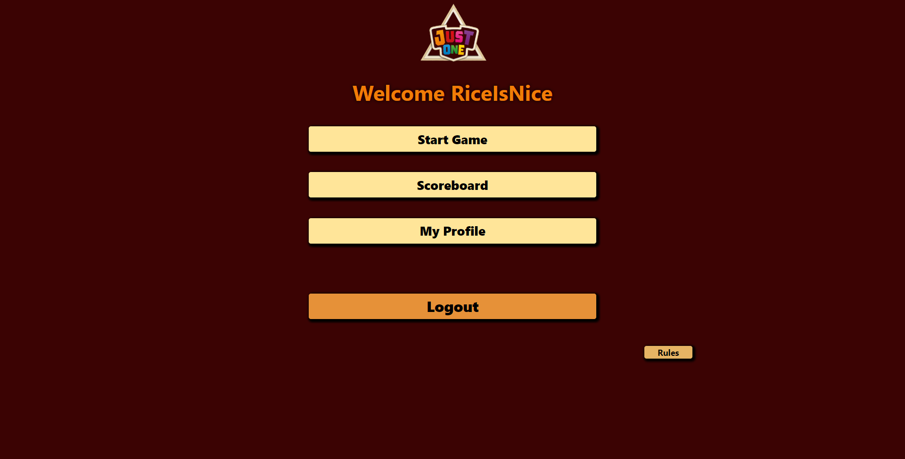

# SoPra FS20 - Group 11 - Just One (Client)

## Introduction

The game “Just One” is developed in accordance with the game’s rules, as a web application. It will have the following features:

- Users can create accounts, which will be visible to other users. They are also able to change their name and username.
- A global score system, where users can compare their score over time. It has a search function, wherein users are able to find each other via username.
- The 550 words from the original game are randomly assigned to a card whenever a new game is created. That way, the game offers more variety and new words can smoothly be added.
- A time tracker for certain user actions. Faster clue giving and guessing will increase the amount of points all of the users get at the end of the game. This amount will be individually modified by how many correct guesses and duplicate clues each user has submitted.
- Clues will, in a first step, be automatically checked by a language processing unit or clue checker. This is where the API service of Datamuse https://www.datamuse.com/api/ comes into play. The unit checks for multiple words, duplicates, singular/plural forms, stemming and homophones.

## Technologies

We used ReactJS to develop our game application.

Read and go through those Tutorials, It will make your life easier!

- Read the React [Docs](https://reactjs.org/docs/getting-started.html)
- Do this React [Getting Started](https://reactjs.org/tutorial/tutorial.html) Tutorial (it doesn’t assume any existing React knowledge)
- Get an Understanding of [CSS](http://localhost:3000) and [HTML](https://www.w3schools.com/html/html_intro.asp)!

Once you have done all of this, in the template there are two main external dependencies that you should look at:

- [styled-components](https://www.styled-components.com/docs)
  It removes the mapping between components and styles (i.e. external css files). This means that when you're defining your styles, you're actually creating a normal React component, that has your styles attached to it
* [react-router-dom](https://reacttraining.com/react-router/web/guides/quick-start) Declarative routing for React being a collection of navigational components that compose declaratively with your application. 

<!-- ## IDE Recommendation
As a student, you have the possibility with [JetBrains](https://www.jetbrains.com/student/) to obtain a free individual license and have access to several IDEs. 
We recommend you to use [WebStorm](https://www.jetbrains.com/webstorm/specials/webstorm/webstorm.html?gclid=EAIaIQobChMIyPOj5f723wIVqRXTCh3SKwtYEAAYASAAEgLtMvD_BwE&gclsrc=aw.ds) for your front-end. 
Once you have downloaded and installed it, you can add the following WebStorm plugins: 
> Go to Preferences > Plugins > Browse Repositories and look for: 
* [styled-components](https://plugins.jetbrains.com/plugin/9997-styled-components) (provides coding assistance like CSS Highlighting for Styled Components)
* [prettier](https://plugins.jetbrains.com/plugin/10456-prettier) (a smart code formatter)
* [Material Theme UI](https://plugins.jetbrains.com/plugin/8006-material-theme-ui) (Material Theme for Jetbrains IDEs, allowing a total customization of the IDE including Themes, Color Schemes, Icons and many other features.)

Feel free to use other IDEs (e.g. [VisualStudio](https://code.visualstudio.com/)) if you want.  -->

## Launch and Deployment

We used an IDE called [Visual Studio Code](https://code.visualstudio.com/) to develop our project and add further functionality. 
In order to make it all work, cloning the server is also a necessity. It needs to be run in a separate IDE, in our project we used [IntelliJ](https://www.jetbrains.com/idea/).
Before running the npm commands (listed further below) with a terminal of your choice, you will need to head to the directory to which you cloned the client code.
Changing code within the IDE and then saving it, will immediately affect your local client. So, you won’t have to wait to see what your changes actually do.

## Prerequisites and Installation

For your local development environment you'll need Node.js >= 8.10. You can download it [here](https://nodejs.org). All other dependencies including React get installed with:

### `npm install`

This has to be done before starting the application for the first time (only once).

### `npm run dev`

Runs the app in the development mode. 
Open [http://localhost:3000](http://localhost:3000) to view it in the browser.

The page will reload if you make edits. 
You will also see any lint errors in the console (use Google Chrome!).

### `npm run test`

Launches the test runner in the interactive watch mode. 
See the section about [running tests](https://facebook.github.io/create-react-app/docs/running-tests) for more information.

### `npm run build`

Builds the app for production to the `build` folder. 
It correctly bundles React in production mode and optimizes the build for the best performance.

The build is minified and the filenames include the hashes. 
Your app is ready to be deployed!

See the section about [deployment](https://facebook.github.io/create-react-app/docs/deployment) for more information.

## Learn More

To learn React, check out the [React documentation](https://reactjs.org/).

>Thanks to Lucas Pelloni for the template

## Illustrations

- After running the client, you will be immediately represented with the login screen. From here on you can reach the signup screen or enter your info, to be redirected to the actual game.

- When you have logged in, you can either create/join a lobby, view player stats on the scoreboard, look at your own stats or have a quick read through the actual game’s rules. Of course there is the possibility to log out.

- After creating a game, other people will be able to join you and only the host may start the game. The game itself is straightforward and just as written in the rules.

- The only thing to consider is that we are using separate pages for each aspect of the game (e.g., drawing a card, giving clues, making a guess,...).
